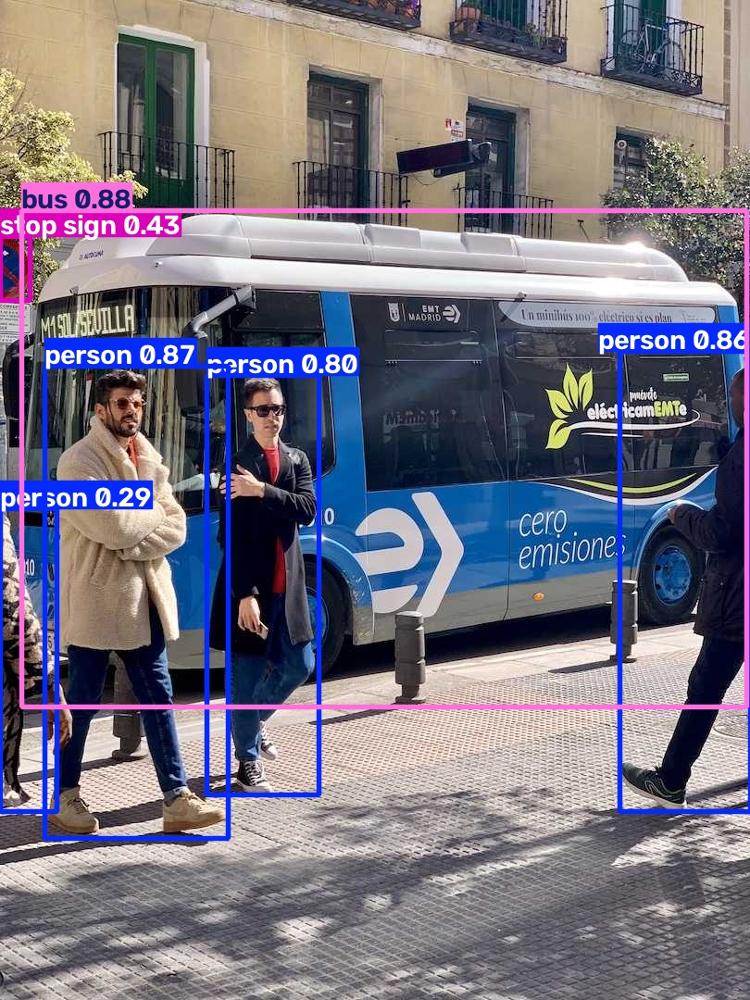
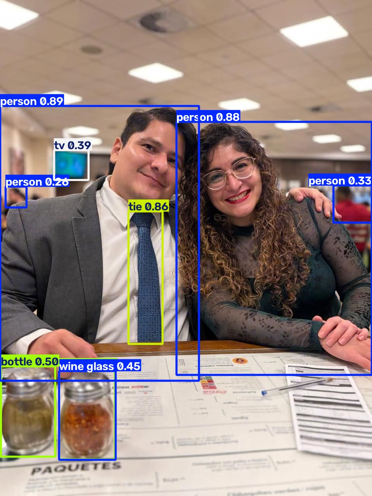

# Ejercicio 1 — Cambiar la imagen de predicción en YOLO

## 1. Resultados de las cuatro predicciones

| Imagen | Celda | Pesos usados | Clases detectadas (confianza) | Cajas | Carpeta de salida |
|---|---|---|---|---|---|
| zidane.jpg | CLI `!yolo predict` | yolov8n.pt original | 2 person (0.84, 0.82), 1 tie (0.29) | 3 | runs/detect/predict |
| bus.jpg | `model(...)` tras 3 épocas | best.pt de train | 4 person (0.87, 0.86, 0.80, 0.29), 1 bus (0.88), 1 stop sign (0.43) | 6 | runs/detect/predict-2 |
| foto.jpg (mía) | CLI `!yolo predict` | yolov8n.pt original | 4 person (0.89, 0.88, 0.33, 0.26), 1 tie (0.86), 2 bottle (0.50 y otra solapada), 1 wine glass (0.45), 1 tv (0.39) | 9 | runs/detect/predict-3 |
| foto.jpg (mía) | `model(...)` tras 3 épocas | best.pt de train-2 | 7 person (0.88, 0.87, 0.46, 0.38 y 3 cajas solapadas al fondo), 1 tie (0.91), 1 bottle, 2 wine glass (0.57, ≈0.4), 1 dining table (0.31), 1 tv (0.35), 1 laptop (0.33) | 14 | runs/detect/predict-4 |

Líneas del log de Ultralytics de donde salen los conteos:

```
image 1/1 /content/zidane.jpg: 384x640 2 persons, 1 tie, 39.1ms
image 1/1 /content/bus.jpg: 640x480 4 persons, 1 bus, 1 stop sign, 36.7ms
image 1/1 /content/foto.jpg: 640x480 4 persons, 1 tie, 2 bottles, 1 wine glass, 1 tv, 90.5ms        (CLI)
image 1/1 /content/foto.jpg: 640x480 7 persons, 1 tie, 1 bottle, 2 wine glasss, 1 dining table, 1 tv, 1 laptop, 24.6ms   (model(...))
```

Capturas (archivos en esta carpeta):

| Archivo | Contenido |
|---|---|
| `zidane (1).jpg` | zidane.jpg original |
| `zidane.jpg` | salida CLI sobre Zidane (predict) |
| `bus (1).jpg` | bus.jpg original |
| `bus.jpg` | salida `model(...)` sobre el bus (predict-2) |
| `foto.jpg` | salida CLI sobre mi foto (predict-3) |
| `foto (1).jpg` | salida `model(...)` sobre mi foto (predict-4) |




.jpg>)

## 2. ¿Qué clases detectó YOLO en las fotos de Ultralytics y cuáles en la tuya?

**Fotos de Ultralytics.** En `zidane.jpg` solo aparecen dos clases: `person` (los dos entrenadores, 0.84 y 0.82) y
`tie` (la corbata de Zidane, 0.29, apenas arriba del umbral porque está medio tapada por el saco). En `bus.jpg`
aparecen `bus` (0.88), `person` ×4 (tres peatones completos con 0.80–0.87 y uno recortado en el borde izquierdo con
0.29) y `stop sign` (0.43). Ese último es en realidad un letrero de "prohibido estacionar" que asoma en la esquina
superior izquierda; COCO no tiene esa clase y el modelo le asigna la señal de tránsito más parecida.

**Mi foto.** Con los pesos originales (CLI) YOLO detectó `person` ×4 (las dos personas en primer plano con 0.89 y
0.88, y dos personas desenfocadas del fondo con 0.33 y 0.26), `tie` (0.86), `bottle` ×2 y `wine glass` (los dos
 saleros sobbre la mesa, ¡SALEROS! xD), y `tv` (una pantalla al fondo, 0.39). Con los pesos afinados (`model(...)`)
se suman `dining table` (0.31) y un `laptop` (0.33) que no existe en la foto.

**Comparación.** `person` y `tie` se repiten en Zidane y en mi foto: las dos tienen un hombre de saco y corbata,
y en ambos casos la corbata es la única prenda que YOLO nombra porque es la única prenda de vestir en COCO.
Las clases exclusivas de mi foto (`bottle`, `wine glass`, `tv`, `dining table`) son del grupo "comedor/cocina"
de COCO, coherente con que es una escena de restaurante; las del bus (`bus`, `stop sign`) son del grupo "calle".
En las tres fotos las cajas grandes y centradas salen con confianza alta (≥ 0.80) y las cajas problemáticas
(recortadas, pequeñas o de clase aproximada) quedan entre 0.26 y 0.50.

## 3. ¿Algún objeto evidente de tu foto no salió etiquetado? ¿Por qué podría pasar?

Sí, varios. Agrupados por causa:

- **Clase que no existe en COCO** (no hay forma de que salgan aunque se vean nítidos): los lentes de mi hermana
  la pluma sobre la mesa, el menú y el ticket, el saco y la camisa.
- **Clase aproximada (objeto etiquetado con el nombre equivocado):** los dos frascos de especias (un salero y un
  frasco de chile) no son botellas ni copas, pero COCO no tiene "frasco".
- **Objeto chico y desenfocado + umbral de confianza:** las personas del fondo del restaurante. En la CLI solo dos
  superan el umbral, con 0.26 y 0.33 (a un pelo de 0.25); en la celda Python salen cinco, varias con cajas
  solapadas. Lo mismo pasa con la pantalla (`tv`, 0.39 / 0.35): es pequeña y borrosa.
- **Recorte por el encuadre:** la mesa ocupa el tercio inferior pero está cortada por los bordes y cubierta por el
  menú; solo aparece como `dining table` en la celda Python y con 0.31.
- **Error inverso (falso positivo):** la celda Python marcó un `laptop` (0.33) sobre el borde de la mesa.

## 4. ¿La predicción de la celda CLI y la de `model(...)` coinciden sobre tu misma imagen?

**No coinciden exactamente: 9 cajas en la CLI frente a 14 en `model(...)`.** Las diferencias:

| Detección | CLI (yolov8n.pt original) | `model(...)` (tras 3 épocas en coco128) |
|---|---|---|
| Personas en primer plano | 0.89, 0.88 | 0.88, 0.87 |
| Corbata | 0.86 | 0.91 |
| Personas del fondo | 2 (0.33, 0.26) | 5 (0.46, 0.38 y tres solapadas) |
| Salero 1 / Salero 2 | bottle 0.50 / wine glass 0.45 (+1 bottle solapada) | wine glass ≈0.4 / wine glass 0.57 (+1 bottle) |
| tv | 0.39 | 0.35 |
| dining table | — | 0.31 |
| laptop (falso positivo) | — | 0.33 |

**Por qué.** Las dos celdas usan el mismo umbral (0.25), el mismo tamaño de entrada (la foto se reescala a 640×480
en ambas) y las mismas 80 clases, pero **no los mismos pesos**. La CLI carga `yolov8n.pt` tal cual se descargó.
En la celda Python, `model.train(data='coco128.yaml', epochs=3)` se ejecuta antes de `model('./foto.jpg')`, y al
terminar el entrenamiento Ultralytics deja cargados en `model` los pesos de `runs/detect/train-2/weights/best.pt`.

**En lo esencial sí coinciden:** las cuatro detecciones fuertes (mi hermana y yo, la corbata y la tele) salen
en las dos celdas con confianzas casi iguales, y las clases principales son las mismas. Todo lo que difiere está
entre 0.26 y 0.57: personas de fondo, el salero que cambia de clase, la mesa y la laptop falsa. 
