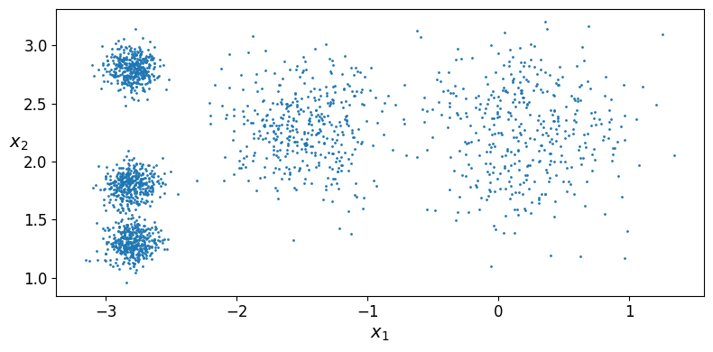
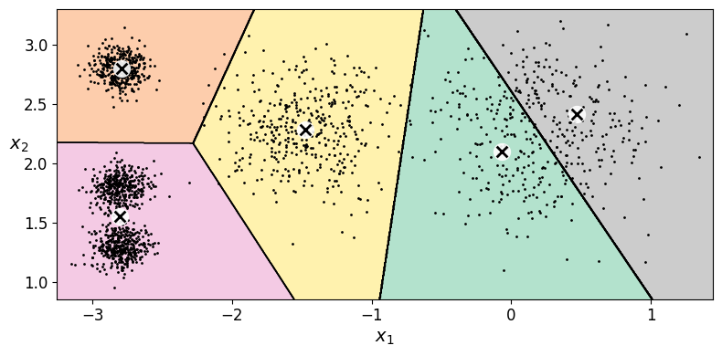
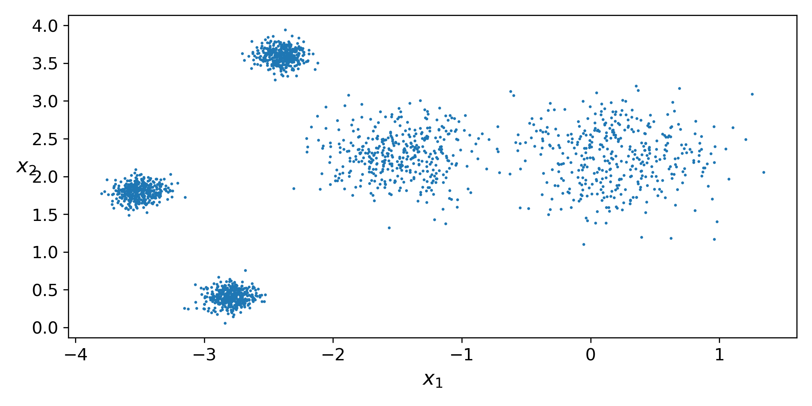
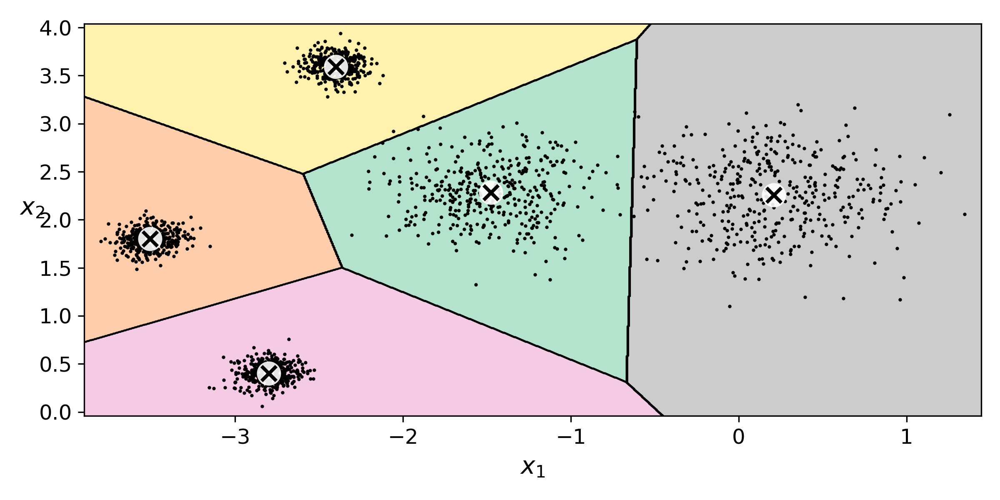
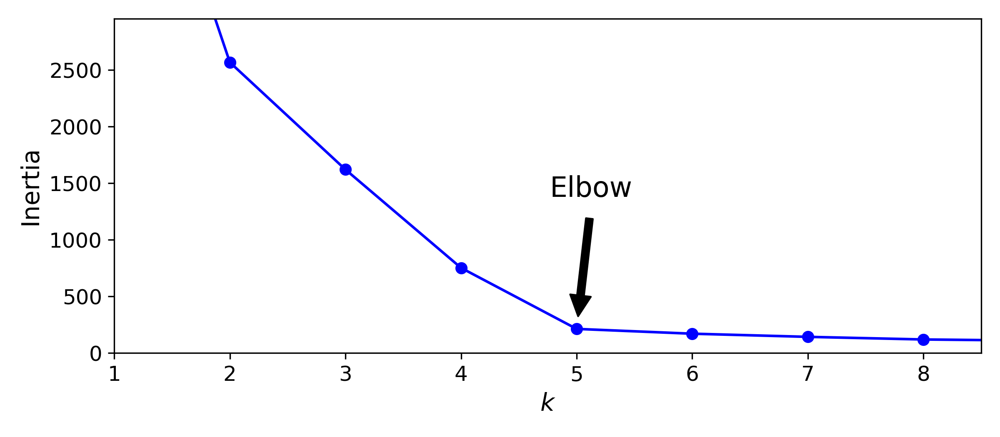
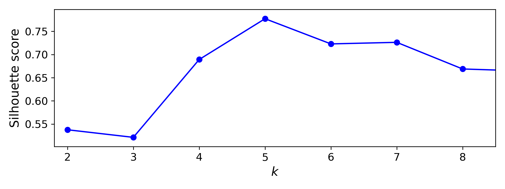
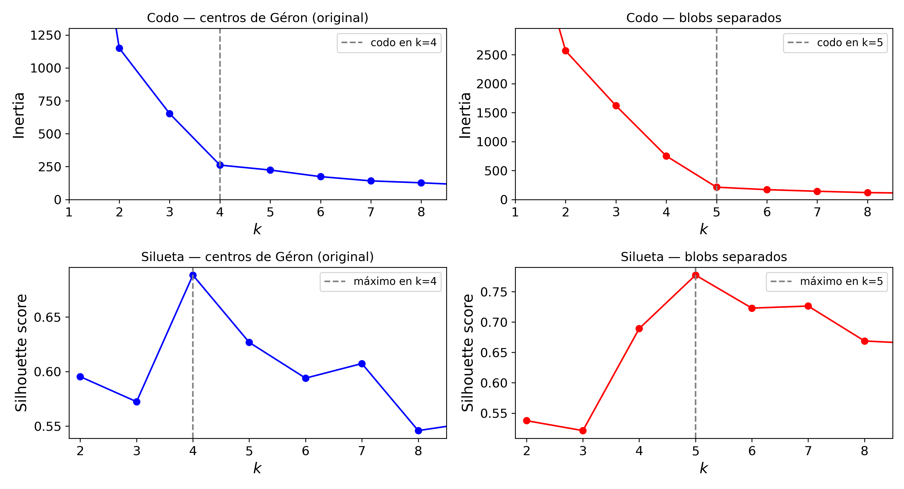

# Ejercicio 1 — Separar los blobs y volver a elegir k

## 1. Corrida original en Colab (centros de Géron)

La notebook se ejecutó completa en Colab (`Runtime -> Run all`) sin tocar `blob_centers` ni `blob_std`.
Valores anotados en la parte de blobs:

| Medida | Valor |
|---|---|
| `kmeans_k3.inertia_` | 653.22 |
| `kmeans.inertia_` (k = 5) | 224.07 |
| `kmeans_k8.inertia_` | 127.13 |
| Codo (a ojo, y donde lo marca Géron) | **k = 4** |
| Silueta máxima | **k = 4** (0.689); k = 5 queda en 0.627 |

Capturas de la corrida original: `scatters.png`, `voronoi.png`, `elbow.png`, `silhouette.png`.





En el scatter se ven **cuatro** manchas, no cinco: las dos nubes de abajo a la izquierda (centros en
(−2.8, 1.8) y (−2.8, 1.3), a solo 0.5 de distancia) parecen una sola gota alargada, y el Voronoi con k = 5 las
mete en la misma región rosa.

## 2. El cambio: los 5 centros y 5 `std` que usé

Un solo cambio, en la celda de los centros. Solo se mueven los **tres blobs de la izquierda** (los de `std = 0.1`
que compartían `x = −2.8`) los dos grandes, `blob_std`, `n_samples=2000` y `random_state=7` quedan igual.

| Blob | Centro Géron | Centro nuevo | `std` (sin cambio) |
|---|---|---|---|
| 0 | (0.2, 2.3) | (0.2, 2.3) | 0.4 |
| 1 | (−1.5, 2.3) | (−1.5, 2.3) | 0.3 |
| 2 | (−2.8, 1.8) | **(−3.5, 1.8)** | 0.1 |
| 3 | (−2.8, 2.8) | **(−2.4, 3.6)** | 0.1 |
| 4 | (−2.8, 1.3) | **(−2.8, 0.4)** | 0.1 |

```python
blob_centers = np.array(
    [[ 0.2,  2.3],
     [-1.5,  2.3],
     [-3.5,  1.8],
     [-2.4,  3.6],
     [-2.8,  0.4]])
blob_std = np.array([0.4, 0.3, 0.1, 0.1, 0.1])
```

Boceto (cada `o` es un centro; `(  )` da idea del radio `std`):

```
        Géron (original)                          Nuevos
 x2                                     x2
4.0 |                                   4.0 |
3.5 |                                   3.5 |        o3
3.0 |                                   3.0 |
2.5 |     o3                            2.5 |
2.0 |          ( o1 )    (  o0  )       2.0 |             ( o1 )    (  o0  )
1.5 |     o2                            1.5 | o2
1.0 |     o4                            1.0 |
0.5 |                                   0.5 |      o4
    +---------------------------            +---------------------------
     -3.5 -3  -2.5 -2 -1.5 -1  0  0.5        -3.5 -3  -2.5 -2 -1.5 -1  0  0.5
```

Distancias entre centros: en Géron la mínima era **0.50** (blobs 2–4), después 1.0 (2–3) y 1.39 (1–2, 1–3).
Con los nuevos centros la mínima es **1.57** (blobs 2–4) y todas las demás están entre 1.58 y 3.73, es decir,
todas muy por encima del umbral 2(σᵢ+σⱼ), que para los blobs chicos vale 0.40.

## 3. Corrida modificada

Celdas nuevas al final de la sección de silueta de `01_K_medias.ipynb` (duplican `make_blobs`, ajuste k = 5,
Voronoi, k = 3 / k = 8, codo, silueta y diagramas de silueta con los mismos hiperparámetros).

| Medida | Original | Blobs separados |
|---|---|---|
| `kmeans_k3.inertia_` | 653.22 | 1621.06 |
| `kmeans.inertia_` (k = 5) | 224.07 | 212.92 |
| `kmeans_k8.inertia_` | 127.13 | 119.55 |
| Codo | k = 4 | **k = 5** |
| Silueta máxima | k = 4 (0.689) | **k = 5 (0.777)** |

Capturas de la corrida modificada: `scatters_separados.png`, `voronoi_separados.png`, `elbow_separados.png`,
`silhouette_separados.png` (y `comparacion_codo_silueta.png` con las cuatro curvas lado a lado).






Ahora sí se distinguen **cinco** nubes a ojo y el Voronoi con k = 5 pone un centroide en cada una
(centroides encontrados: (0.209, 2.256), (−1.476, 2.285), (−3.507, 1.800), (−2.399, 3.595), (−2.800, 0.401),
prácticamente los centros verdaderos).

## 4. Comparación con números: codo y silueta para k = 1…9

| k | 1 | 2 | 3 | 4 | 5 | 6 | 7 | 8 | 9 |
|---|---|---|---|---|---|---|---|---|---|
| Inercia original | 3534.8 | 1149.9 | 653.2 | **261.8** | 224.1 | 173.9 | 141.8 | 127.1 | 109.9 |
| Caída J(k−1)−J(k) | | 2384.9 | 496.7 | 391.4 | **37.7** | 50.2 | 32.1 | 14.7 | 17.2 |
| Inercia separados | 5598.3 | 2568.5 | 1621.1 | 752.2 | **212.9** | 170.5 | 142.7 | 119.6 | 109.1 |
| Caída J(k−1)−J(k) | | 3029.7 | 947.5 | 868.8 | **539.3** | 42.4 | 27.8 | 23.1 | 10.5 |
| Silueta original | | 0.595 | 0.572 | **0.689** | 0.627 | 0.594 | 0.607 | 0.546 | 0.554 |
| Silueta separados | | 0.538 | 0.521 | 0.689 | **0.777** | 0.723 | 0.726 | 0.669 | 0.664 |



## 5. Respuestas

**a) En los datos de Géron, ¿por qué el codo "prefiere" k = 4 si `make_blobs` usó 5 centros?**
Porque el codo no cuenta nubes, mide cuánto baja la inercia al agregar un centroide.

**b) Con mis blobs separados, ¿el codo y la silueta coinciden en el mismo k? ¿Ese k es 5?**
Sí y sí. La caída de inercia de k = 4 a k = 5 pasa de 37.7 a **539.3**, mientras que la de k = 5 a k = 6 se
queda en 42.4, el codo se movió de 4 a **5**. 

**c) Si el codo siguiera en 4, ¿qué faltaría mover: distancia entre centros o `blob_std`?**
La distancia. Lo que decide el codo es la **razón distancia/std** entre las nubes más cercanas

## 6. Archivos y evidencia

| Archivo | Contenido |
|---|---|
| `01_K_medias.ipynb` | Copia de la notebook con la corrida original (Colab) y la sección "Ejercicio 1 — Blobs separados" |
| `scatters.png`, `voronoi.png`, `elbow.png`, `silhouette.png` | Corrida original |
| `scatters_separados.png`, `voronoi_separados.png`, `elbow_separados.png`, `silhouette_separados.png` | Corrida modificada |
| `comparacion_codo_silueta.png` | Codo y silueta, original contra separados |
| `colab_runtime.png` | Captura del entorno / menú Runtime de Colab |


